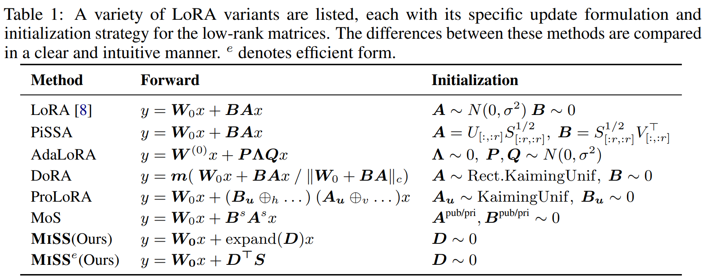
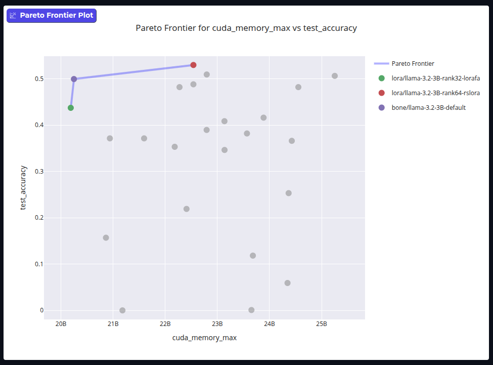

<div align="center" >
     

**MiSS: Balancing LoRA Performance and Efficiency with Simple Shard Sharing**

[](https://arxiv.org/abs/2409.15371)
<a href="https://github.com/huggingface/trl/blob/main/LICENSE"></a>

[🤗PEFT](https://github.com/huggingface/peft/tree/main/src/peft/tuners/bone) |
[📑Paper](https://arxiv.org/abs/2409.15371) |
[📘Documentation](https://huggingface.co/docs/peft/main/package_reference/bone) |
[🛠️Installation](https://huggingface.co/docs/peft/install#source) |
[❓Issues](https://github.com/JL-er/MiSS/issues/new/choose)

</div>

> \[!IMPORTANT\]
>
> **MiSS** is supported by [Huggingface/peft](https://github.com/huggingface/peft.git)
> 
>Paper Version(Bone->DiSHA->MiSS)
>
> We are still improving **MiSS**


MiSS (Matrix Shard Sharing) is a novel Parameter-Efficient Fine-Tuning (PEFT) method designed to address the trade-off between adaptability and efficiency in Large Language Models. The core approach of MiSS involves a simple shard-sharing mechanism. It achieves low-rank adaptation by decomposing a weight matrix into multiple fragments and then utilizing a shared, trainable "common fragment." The final low-rank update matrix is constructed by replicating these shared, partitioned shards.


## 🚀News
- **\[2025.06.13\]** Our paper was accepted by ES-Fomo III workshop @ICML2025! 🔥🔥🔥
- **\[2025.05.16\]** We released a new version of our paper!(MiSS) 🔥🔥🔥
- **\[2024.12.31\]** We released a new version of our paper!(DiSHA) 🔥🔥🔥
- **\[2024.11.05\]** Merged into the Hugging Face PEFT repo! 🔥🔥🔥
- **\[2024.09.19\]** Our paper was available on ArXiv!(Bone) 🔥🔥🔥
- **\[2024.08.07\]** First proposed the Bone method! 🔥🔥🔥

## 🔧Installation
### HF Model
MiSS is currently being merged into the official PEFT repository. In the future, you will only need to run `pip install peft`
```
git clone https://github.com/huggingface/peft.git
cd peft
pip install -e .
```
```
git clone https://github.com/JL-er/MiSS.git
```
```
cd MiSS
sh scripts/run_miss.sh
```
### RWKV Model
```
git clone https://github.com/JL-er/RWKV-PEFT.git
```
You can check the script settings in the Bone/rwkv-ft file and replace them in the RWKV-PEFT/scripts directory.
```
cd RWKV-PEFT
pip install -r requirements.txt
sh scripts/run_bone.sh
sh scripts/merge_bone.sh
```
### Advanced Usage
```
import torch
import os
from peft import BoneConfig, get_peft_model
from transformers import AutoTokenizer, AutoModelForCausalLM
MODEL_ID = "meta-llama/Llama-2-7b-hf"
model = AutoModelForCausalLM.from_pretrained(MODEL_ID, torch_dtype=torch.bfloat16, device_map="auto")
tokenizer = AutoTokenizer.from_pretrained(MODEL_ID)
tokenizer.pad_token_id = tokenizer.eos_token_id
bone_config = BoneConfig(
    r=64,
    target_modules=["q_proj", "o_proj", "k_proj", "v_proj", "gate_proj", "up_proj", "down_proj"],
    task_type="CAUSAL_LM",
)
peft_model = get_peft_model(model, bone_config)
peft_model.print_trainable_parameters()
OUTPUT_DIR="Bone-Llama-2-7b-hf-r64"
# Save Bone modules:
peft_model.peft_config["default"].init_lora_weights = True # Important
peft_model.save_pretrained(OUTPUT_DIR)
# Save residual model:
peft_model = peft_model.unload()
peft_model.save_pretrained(OUTPUT_DIR)
# Save the tokenizer:
tokenizer.save_pretrained(OUTPUT_DIR)
```
<p>
  
</p>


|Metohd|Space|Time|
|:--------------:|:--------------:|:--------------:|
|Full |O(dk) |O(bld(d + k))
|LoRA |O(dr + rk) |O(blr(d + k))
|MISS |O(dr) |O(bldk)
|MISS_e |O(dr)| O(blr(d +kr))

### PEFT Arena
<p>
  
</p>

<details>
<summary>🔍 <b>Bat: Block Affine Transformation</b> </summary>
We conducted extensive experiments on both NLU and NLG tasks to validate the effectiveness of Bone. It outperforms many LoRA variants and surpasses LoRA in terms of memory consumption and computational efficiency.
However, we found that Bone results in the updates between different shards within the same matrix being collinear. Specifically, all shards in the weights use the same trainable matrix for updates, causing the updates of all shards to be collinear, restricting the model’s expressive power. To address the issue of linear correlation among shard updates, our initial idea was to use a trainable coefficient matrix to control the updates of different shards. However, this approach would increase additional parameters.

Inspired by methods like PiSSA that leverage pre-trained weight matrix information, we propose \textbf{Block Affine Transformation (Bat)} to break update collinearity without adding parameters. The key insight is to leverage pre-trained weights $\mathbf{W}_0$ as nonlinear projectors:  

1. \textbf{Tensor Factorization}:  

   \textbullet\  Reshape $\mathbf{W}_0 \in \mathbb{R}^{d \times k}$ into 4D tensor $\mathcal{W}_0 \in \mathbb{R}^{\frac{k}{r} \times \frac{d}{r} \times r \times r}$  
   
   \textbullet\  Reshape $\mathbf{D} \in \mathbb{R}^{r \times d}$ into $\mathcal{D} \in \mathbb{R}^{\frac{d}{r} \times r \times r}$  

2. \textbf{Affine Transformation}:  
   Compute shard-specific updates via tensor contraction:  
   \[
   \Delta \mathcal{W} = \mathcal{W}_0 \times \mathcal{D} + \mathcal{D} \quad \in \mathbb{R}^{\frac{k}{r} \times \frac{d}{r} \times r \times r}  
   \]  
   where $\times_3$ denotes contraction along the third dimension.  

3. \textbf{Reconstruction}:  
   Reshape $\Delta \mathcal{W}$ to obtain full update matrix:  
   \[
   \Delta \mathbf{W} = \operatorname{Reshape}(\Delta \mathcal{W}) \in \mathbb{R}^{d \times k}  
   \]  
Bat allows for flexible configuration of different dimensional transformation strategies based on the settings of $\mathbf{D}$. For example: 

Bat-Row:  
  Reshape $\mathbf{W}_0$ into $\mathcal{W} \in \mathbb{R}^{\frac{d}{r} \times \frac{k}{r} \times r \times r}$ and $\mathbf{D} \in \mathbb{R}^{r \times k}$ into $\mathcal{D} \in \mathbb{R}^{\frac{k}{r} \times r \times r}$
  
Bat-Col:  
    Reshape $\mathbf{W}_0$ into $\mathcal{W} \in \mathbb{R}^{\frac{k}{r} \times \frac{d}{r} \times r \times r}$ and $\mathbf{D} \in \mathbb{R}^{r \times d}$ into $\mathcal{D} \in \mathbb{R}^{\frac{d}{r} \times r \times r}$

The term $\mathcal{W}_0 \times \mathcal{D}$ introduces shard-dependent perturbations proportional to $\mathbf{W}_0$'s singular vectors, breaking the collinearity enforced by Bone's shared $\mathbf{D}$.


</details>


# Citation
If you find this repo useful, please consider citing our works:
# Citation
```bib
@misc{kang2025balancingloraperformanceefficiency,
      title={Balancing LoRA Performance and Efficiency with Simple Shard Sharing}, 
      author={Jiale Kang and Qingyu Yin},
      year={2025},
      eprint={2409.15371},
      archivePrefix={arXiv},
      primaryClass={cs.CL},
      url={https://arxiv.org/abs/2409.15371}, 
}
```
