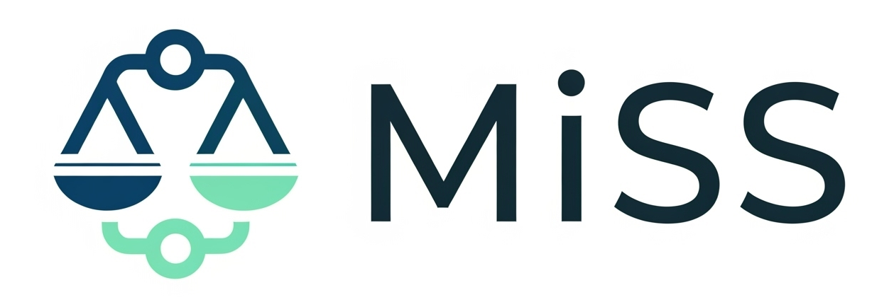

<div align="center" >
     

**MiSS: Balancing LoRA Performance and Efficiency with Simple Shard Sharing**

[](https://arxiv.org/abs/2409.15371)
<a href="https://github.com/huggingface/trl/blob/main/LICENSE"></a>

[🤗PEFT](https://github.com/huggingface/peft/tree/main/src/peft/tuners/bone) |
[📑Paper](https://arxiv.org/abs/2409.15371) |
[📘Documentation](https://huggingface.co/docs/peft/main/package_reference/bone) |
[🛠️Installation](https://huggingface.co/docs/peft/install#source) |
[❓Issues](https://github.com/JL-er/MiSS/issues/new/choose)

</div>

> \[!IMPORTANT\]
>
> **MiSS** is supported by [Huggingface/peft](https://github.com/huggingface/peft.git)
> 
> We are still improving **MiSS**, and for the previous versions of the paper please visit [here](https://arxiv.org/abs/2409.15371v1).


MiSS (Matrix Shard Sharing) is a novel Parameter-Efficient Fine-Tuning (PEFT) method designed to address the trade-off between adaptability and efficiency in Large Language Models. The core approach of MiSS involves a simple shard-sharing mechanism. It achieves low-rank adaptation by decomposing a weight matrix into multiple fragments and then utilizing a shared, trainable "common fragment." The final low-rank update matrix is constructed by replicating these shared, partitioned shards.


## 🚀News
- **\[2025.06.13\]** Our paper was accepted by ES-Fomo III workshop @ICML2025! 🔥🔥🔥
- **\[2025.05.16\]** We released a new version of our paper! 🔥🔥🔥
- **\[2024.09.19\]** Our paper was available on ArXiv! 🔥🔥🔥

## 🔧Installation
### HF Model
MiSS is currently being merged into the official PEFT repository. In the future, you will only need to run `pip install peft`
```
git clone https://github.com/huggingface/peft.git
cd peft
pip install -e .
```
```
git clone https://github.com/JL-er/MiSS.git
```
```
cd MiSS
sh scripts/run_bone.sh
```
### RWKV Model
```
git clone https://github.com/JL-er/RWKV-PEFT.git
```
You can check the script settings in the Bone/rwkv-ft file and replace them in the RWKV-PEFT/scripts directory.
```
cd RWKV-PEFT
pip install -r requirements.txt
sh scripts/run_bone.sh
sh scripts/merge_bone.sh
```
### Advanced Usage
```
import torch
import os
from peft import BoneConfig, get_peft_model
from transformers import AutoTokenizer, AutoModelForCausalLM
MODEL_ID = "meta-llama/Llama-2-7b-hf"
model = AutoModelForCausalLM.from_pretrained(MODEL_ID, torch_dtype=torch.bfloat16, device_map="auto")
tokenizer = AutoTokenizer.from_pretrained(MODEL_ID)
tokenizer.pad_token_id = tokenizer.eos_token_id
bone_config = BoneConfig(
    r=64,
    target_modules=["q_proj", "o_proj", "k_proj", "v_proj", "gate_proj", "up_proj", "down_proj"],
    task_type="CAUSAL_LM",
)
peft_model = get_peft_model(model, bone_config)
peft_model.print_trainable_parameters()
OUTPUT_DIR="Bone-Llama-2-7b-hf-r64"
# Save Bone modules:
peft_model.peft_config["default"].init_lora_weights = True # Important
peft_model.save_pretrained(OUTPUT_DIR)
# Save residual model:
peft_model = peft_model.unload()
peft_model.save_pretrained(OUTPUT_DIR)
# Save the tokenizer:
tokenizer.save_pretrained(OUTPUT_DIR)
```


### DISHA design space
<p>
  
</p>

### Comparison of Initial Gradients and Convergence Speed
<p float="left">
  
   
</p>

### Eval
<p>
  
</p>


# Citation
If you find this repo useful, please consider citing our works:
# Citation
```bib
@misc{kang2025balancingloraperformanceefficiency,
      title={Balancing LoRA Performance and Efficiency with Simple Shard Sharing}, 
      author={Jiale Kang and Qingyu Yin},
      year={2025},
      eprint={2409.15371},
      archivePrefix={arXiv},
      primaryClass={cs.CL},
      url={https://arxiv.org/abs/2409.15371}, 
}
```
